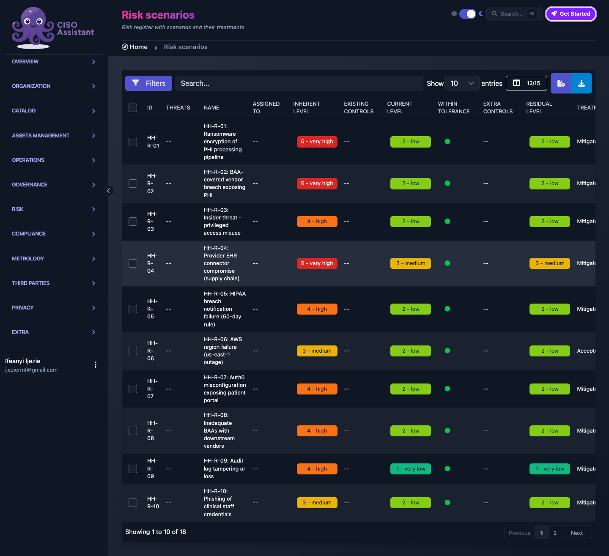
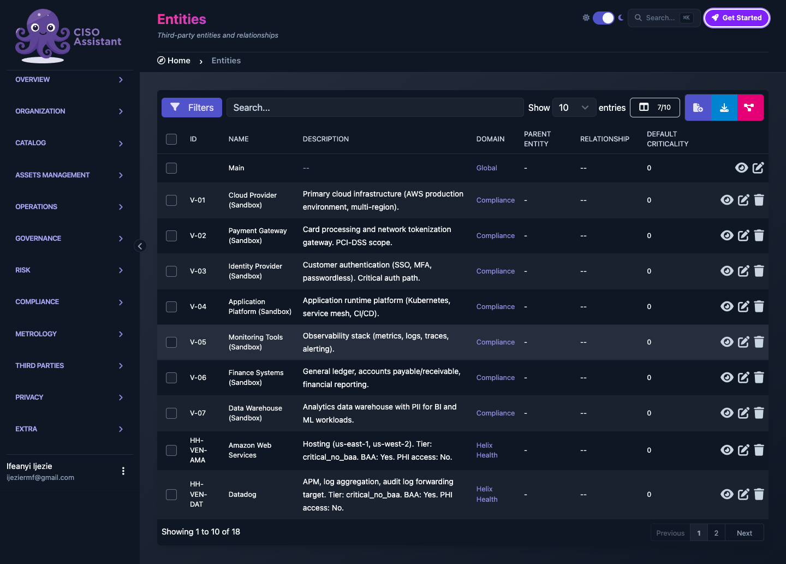
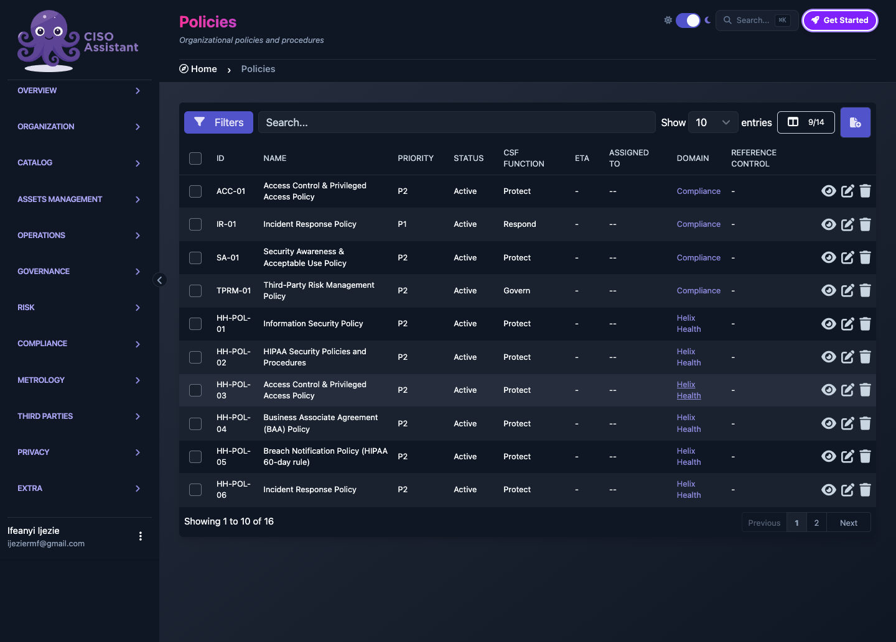
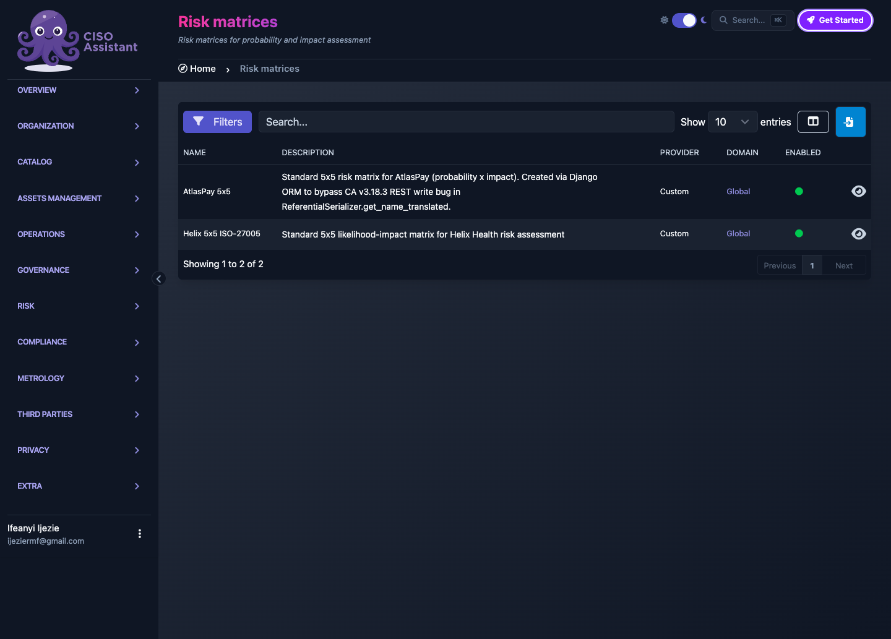
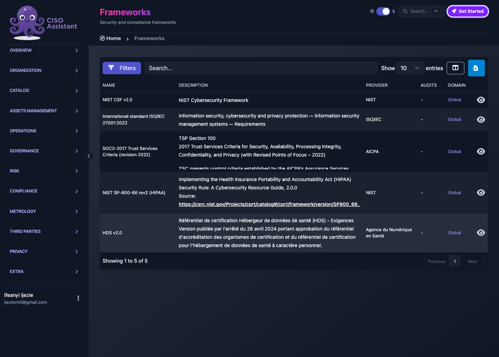

# Helix Health HIPAA + SOC 2 GRC Engagement

> **HIPAA + SOC 2 readiness assessment for a HealthTech SaaS, quantitative risk register, ROPA, BAA-tracked vendors, and SIEM-integrated audit log forwarding.**

---

## What This Demonstrates

| Capability | Details |
|---|---|
| **Engagement Type** | HIPAA Security Rule risk analysis + SOC 2 Type 2 readiness |
| **Methodology** | Quantitative 5x5 risk matrix, NIST SP 800-66 rev 2, ROPA, control mapping |
| **Deliverables** | Risk register, 12 risk scenarios, 12 policies, 10 BAA-tracked vendors, ROPA, SIEM forwarder |
| **Stakeholder Focus** | BAA-covered providers, Series C investor due diligence, HIPAA regulators |
| **Industry Relevance** | HealthTech SaaS handling PHI, BAA-governed, OCR audit-defensible |

---

## Overview

Helix Health is a 50-employee HealthTech SaaS serving 1,200 BAA-covered providers and 2.4 million patient records. At a $47 million Series B and preparing for Series C, the organization faced a 12-month SOC 2 Type 2 audit window and a HIPAA Security Rule risk analysis requirement tied to Business Associate Agreement (BAA) renewals. The engagement scope was to act as embedded vCISO: lead the risk assessment, document the privacy record, map controls across HIPAA and SOC 2, and stand up audit-log forwarding that satisfies both regimes.

The methodology combined NIST SP 800-66 rev 2, the OCR-recognized HIPAA implementation guide, with the SOC 2 Trust Services Criteria 2022. Risk was scored quantitatively on a 5x5 impact-likelihood matrix with inherent and residual tracking. A Record of Processing Activities (ROPA) was built around 15 PHI handling activities. Vendors were inventoried and BAA-classified by contract tier. The result is a defensible, board-ready package rather than a compliance checklist.

Deliverables included a 12-scenario risk register, a 12-policy library, a 10-vendor BAA-tracked inventory, a 15-activity ROPA, five validation workflows, an audit-log forwarding design, and an executive portfolio PDF. These artifacts show that Helix could present evidence to OCR, pass SOC 2 auditor scrutiny, and reassure providers and investors that risk was being governed, not guessed.

---

## Deliverables

| Artifact | Purpose | Audience |
|---|---|---|
| **Risk Register (12 scenarios)** | Board and CISO view of exposure with inherent and residual scores | Leadership, auditors |
| **Policy Library (12 policies)** | Operational governance mapped to CSF functions and compliance requirements | Operations, compliance |
| **Vendor Inventory (10 vendors, BAA-tracked)** | Contract-tiered third-party risk evidence for BAA renewals | Provider trust teams, OCR |
| **ROPA (15 processing activities)** | GDPR-style privacy record documenting PHI handling and lawful basis | Privacy, legal |
| **Validation Flows (5 approver workflows)** | Operational governance for risk acceptance, policy review, vendor onboarding | Risk owners |
| **Audit Log Forwarder** | SOC 2 CC7 monitoring and 6-year HIPAA retention evidence | Security operations, auditors |
| **Portfolio PDF** | Executive briefing with charts and engagement narrative | Board, investors, prospects |

Primary portfolio PDF: [Helix Health Portfolio v2 (8 pages, with charts, 976KB)](deliverables/Helix_Health_Portfolio_v2.pdf)

Also available: [Helix Health Portfolio v1 (8 pages, text version, 97KB)](deliverables/Helix_Health_Portfolio_v1.pdf)



*Risk register color-coded on a 5x5 matrix. Inherent and residual risk are tracked for each scenario.*



*Vendor inventory with BAA tracking and contract tier classification, built for provider trust and OCR audit evidence.*

---

## Key Features

- ✅ **HIPAA Security Rule coverage via NIST SP 800-66 rev 2**, the OCR-recognized implementation guide
- ✅ **SOC 2 Trust Services Criteria 2022 mapping** across all five trust principles
- ✅ **Quantitative risk scoring (5x5 matrix)** with inherent versus residual tracking
- ✅ **BAA-tracked vendor inventory** with contract tier classification
- ✅ **Complete ROPA documenting 15 processing activities**, covering PHI handling, breach notification, and patient consent
- ✅ **SIEM-integrated audit log forwarding** with 6-year HIPAA retention



*Policy library mapped to priority and CSF function, giving operations and auditors a direct compliance thread.*

---

## Methodology

```
1. Scope & Stakeholder Alignment
   └─→ HIPAA Security Rule risk analysis + 12-month SOC 2 Type 2 readiness
   └─→ Stakeholders: providers under BAAs, Series C investors, OCR, SOC 2 auditors

2. Framework Loading
   └─→ NIST SP 800-66 rev 2 for HIPAA implementation
   └─→ SOC 2 TSC 2022 across all five trust principles
   └─→ NIST CSF 2.0, ISO 27001:2022, HDS v2.0 as cross-reference taxonomy

3. Asset & Vendor Discovery
   └─→ 3 perimeters defined: production PHI platform, analytics, admin tooling
   └─→ 10 vendors classified by BAA status and contract tier

4. Risk Identification & Scoring
   └─→ 12 risk scenarios mapped to assets, threats, and controls
   └─→ Inherent risk scored on 5x5 impact-likelihood matrix
   └─→ Treatment plans, control gaps, and residual risk calculated

5. Privacy Record & Governance
   └─→ 15-activity ROPA documenting PHI flow, lawful basis, retention, recipients
   └─→ 5 validation workflows for approvals and review cycles

6. Audit-Readiness Evidence
   └─→ Audit log forwarding design for SOC 2 CC7 and HIPAA retention
   └─→ Executive portfolio PDF for board, investors, and prospects
```

---

## Sample Risk Register Entry

| Field | Example |
|---|---|
| **Risk ID** | HH-R-03 (PHI breach via compromised vendor credentials) |
| **Affected Assets** | BAA-scope PHI database, vendor integration endpoints |
| **Business Impact** | OCR enforcement, breach notification to 2.4M patients, reputational harm |
| **Inherent Risk** | Very High (4x4) |
| **Existing Controls** | Vendor BAA, MFA on integration accounts, quarterly vendor access review |
| **Control Gaps** | No privileged session monitoring on vendor accounts |
| **Treatment** | Deploy PAM with session recording for all vendor accounts |
| **Residual Risk** | Low (1x1) post-treatment |

| Field | Example |
|---|---|
| **Risk ID** | HH-R-07 (Audit log tampering or deletion) |
| **Affected Assets** | SIEM, audit log repository, SOC 2 CC7 evidence |
| **Business Impact** | SOC 2 failure, HIPAA violation, undetected breach activity |
| **Inherent Risk** | High (3x4) |
| **Existing Controls** | Role-based access to log console, nightly backups |
| **Control Gaps** | Logs not forwarded to tamper-resistant SIEM; retention policy inconsistent |
| **Treatment** | Implement SIEM forwarding with WORM storage and 6-year retention |
| **Residual Risk** | Low (1x2) post-treatment |



*ISO-27005-aligned 5x5 matrix used to convert qualitative scenarios into consistent quantitative scores.*

---

## Sample ROPA Entry

| Processing Activity | Detail |
|---|---|
| **Activity ID** | HH-PROC-04 (Patient portal authentication) |
| **Data Categories** | PHI: patient demographics, treatment history |
| **Lawful Basis** | Treatment relationship (HIPAA-permitted use) |
| **Recipients** | Internal: providers, billing. External: identity provider under BAA |
| **Retention** | 6 years post-last encounter (HIPAA) |
| **Cross-border** | US-only |

| Processing Activity | Detail |
|---|---|
| **Activity ID** | HH-PROC-11 (Breach notification recordkeeping) |
| **Data Categories** | PHI affected by suspected breach, notification logs |
| **Lawful Basis** | HIPAA Breach Notification Rule obligation |
| **Recipients** | Internal: privacy officer, legal. External: OCR, affected individuals, media when threshold met |
| **Retention** | 6 years from creation date |
| **Cross-border** | US-only |

---

## Why This Matters

For a HealthTech SaaS, HIPAA and SOC 2 are not separate back-office exercises. They are market-access requirements. Providers will not sign BAAs without a current risk analysis. Investors will not advance Series C without clean audit evidence. Regulators will ask for documentation that ties risk, controls, and monitoring together in plain language.

This engagement shows that risk can be quantified, controls can be mapped to multiple frameworks at once, and audit evidence can be designed into operations rather than assembled after the fact. The ROPA, risk register, and vendor inventory together give Helix a single source of truth for security, privacy, and compliance conversations. The audit-log forwarder turns monitoring from a SOC 2 checkbox into a HIPAA retention and incident-detection capability.

The business value is speed and credibility. BAA renewals move faster when providers see defensible risk data. Auditor days cost less when evidence is pre-organized. Investors see a management team that treats governance as a growth enabler, not a cost center.

---

## Value to GRC Consulting

| Service | Application |
|---|---|
| **HIPAA Risk Analysis** | Exactly what OCR requests in an audit: risk identification, scoring, treatment, documentation |
| **SOC 2 Type 2 Readiness** | Pre-audit posture assessment mapped to the 2022 Trust Services Criteria |
| **BAA Program Management** | Vendor risk framework with contract tier classification and evidence trail |
| **Privacy Program (ROPA)** | GDPR-style record tailored to PHI handling, consent, and breach notification |

---

## Tools & Frameworks

| Tool/Framework | Use |
|---|---|
| **NIST SP 800-66 rev 2** | HIPAA implementation guide, OCR-recognized |
| **SOC 2 TSC 2022** | Trust Services Criteria mapping |
| **NIST CSF 2.0** | Cross-reference taxonomy for executive communication |
| **ISO 27001:2022** | International alignment for global customer conversations |
| **HDS v2.0** | French health data hosting standard, extending international scope |
| **CISO Assistant CE** | GRC platform used to ingest, structure, and evidence the engagement |



*Five frameworks loaded in the GRC platform, giving Helix a multi-standard control backbone.*

---

## Key Takeaways

1. **HIPAA and SOC 2 can be assessed through one risk register.** Mapping NIST SP 800-66 and SOC 2 TSC to the same scenarios reduces duplicate work and produces a single narrative for providers, auditors, and investors.

2. **BAA governance is a board issue, not a procurement issue.** Tracking 10 vendors by BAA status, contract tier, and access scope turns vendor risk into evidence that supports both renewals and fundraising.

3. **ROPA is a risk register for privacy.** When 15 processing activities are documented with lawful basis, recipients, retention, and cross-border status, privacy becomes defensible and auditable.

4. **Monitoring evidence must outlast the audit window.** A SIEM-integrated audit log forwarder with 6-year retention satisfies SOC 2 CC7 and HIPAA, and gives Helix the historical evidence it needs for breach investigation.

---

## Related Projects

- [AtlasPay Risk Assessment](https://github.com/ijeziermf/AtlasPay-Risk-Assessment): NIST SP 800-53 Rev. 5 risk assessment for FinTech and SaaS.
- [AtlasPay Risk Profile & BCP](https://github.com/ijeziermf/AtlasPay-Risk-Profile-BCP): Business continuity and risk profile for payment processing.
- [Cyber-Security Policy Library](https://github.com/ijeziermf/Cyber-Security-Policy-Library): NIST-aligned governance policy templates.
- [Scenario-Based Cyber Risk Analyses](https://github.com/ijeziermf/Scenario-Based-Cyber-Risk-Analyses): Privileged account abuse and vendor breach scenarios with quantitative scoring.
- [CISO Assistant Community](https://github.com/ijeziermf/ciso-assistant-community): Open-source GRC platform used to evidence this engagement.

---

## License

This project is for educational and portfolio demonstration purposes. Organizations may adapt the methodology for internal use.
