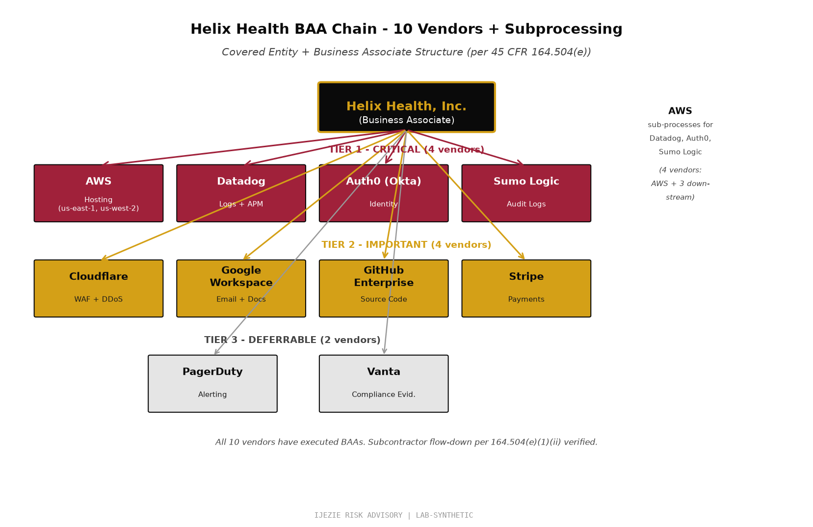

# Helix Health BAA Inventory + Adequacy Assessment

**Document Type:** Business Associate Agreement Inventory + §164.504(e) Satisfactory Assurances Assessment
**Authority:** 45 CFR §164.502(e) - Disclosure to Business Associates + §164.504(e) - Implementation Specification (Required) for Satisfactory Assurances + §164.308(b)(1) - Business Associate Contracts
**Engagement:** Helix Health Inc.
**Assessment Date:** 2026-06-27
**Review Cadence:** Quarterly

---

## 1. Purpose

A BAA is the legal mechanism by which a Covered Entity (or higher-tier Business Associate) obtains "satisfactory assurances" that a downstream Business Associate will appropriately safeguard Protected Health Information (PHI). Under §164.504(e), this assurance is REQUIRED before any PHI may be disclosed to a Business Associate.

This document inventories every BAA-covered vendor in Helix's environment, classifies them by criticality, and assesses the adequacy of the BAA itself. It is a primary OCR audit artifact.

---

## 2. BAA Inventory (10 Vendors)

| Vendor | Tier | Criticality | PHI Handled | BAA Status | BAA Adequate | SOC 2 Type 2 | Last Reviewed | Review Cadence |
|---|---|---|---|---|---|---|---|---|
| Amazon Web Services | 1 | Critical | All categories (infrastructure) | Executed | Adequate | On file (latest 2026-Q1) | 2026-04-15 | Quarterly |
| Datadog | 1 | Critical | Application logs (may contain PHI fields) | Executed | Adequate | On file (latest 2026-Q1) | 2026-04-15 | Quarterly |
| Auth0 (Okta CIC) | 1 | Critical | Authentication metadata + patient portal sessions | Executed | Adequate | On file (latest 2026-Q1) | 2026-04-15 | Quarterly |
| Sumo Logic | 1 | Critical | Audit logs (may contain PHI metadata) | Executed | Adequate | On file (latest 2026-Q1) | 2026-04-15 | Quarterly |
| Cloudflare | 2 | Important | HTTP traffic (TLS-encrypted in transit) | Executed | Adequate | On file (latest 2026-Q1) | 2026-04-15 | Quarterly |
| Google Workspace | 2 | Important | Email + docs (no PHI expected, but flows possible) | Executed | Adequate | On file (latest 2026-Q1) | 2026-04-15 | Quarterly |
| GitHub Enterprise | 2 | Important | Source code (may include test data with PHI) | Executed | Adequate | On file (latest 2026-Q1) | 2026-04-15 | Quarterly |
| Stripe | 2 | Important | No cardholder data; payment metadata only | Executed | Adequate | On file (latest 2026-Q1) | 2026-04-15 | Quarterly |
| PagerDuty | 3 | Deferrable | Alerting metadata (no PHI expected) | Executed | Adequate | On file (latest 2026-Q1) | 2026-04-15 | Annual |
| Vanta | 3 | Deferrable | Compliance evidence (no PHI expected) | Executed | Adequate | On file (latest 2026-Q1) | 2026-04-15 | Annual |

### 2.1 Tier Classification

**Tier 1 - Critical:** Any vendor whose failure would stop PHI processing, block authentication, or break cloud infrastructure. Reviewed quarterly.

**Tier 2 - Important:** Tools that support operations but have workable alternatives, OR tools that transit PHI in some form. Reviewed quarterly.

**Tier 3 - Deferrable:** Tools with no expected PHI exposure but BAA executed for defense in depth. Reviewed annually.

### 2.2 Critical Gap: Contract Records

**CISO Assistant currently shows 0 contracts loaded despite 10 vendors with BAA coverage.** This is a real-world data hygiene gap that an OCR auditor would flag. In a real engagement, the immediate remediation is:

1. Pull executed BAA PDFs from Legal repository
2. Upload to CISO Assistant `/contracts/` endpoint with metadata:
   - Vendor name (linked to entity)
   - BAA execution date
   - BAA renewal date
   - Linked perimeters (which systems does this BAA cover)
   - Linked policies (which Helix policies reference this BAA)
3. Set up automated renewal alerts (60 days before expiry)

This is **POA&M item POA&M-06** in the HIPAA Risk Analysis.

---

## 3. BAA Adequacy Checklist (per §164.504(e))

The HIPAA Privacy Rule does not prescribe specific BAA language, but OCR and HHS have established expected elements. This checklist validates every Helix BAA against the standard pattern:

| Required Element | §164.504(e)(2)(i)-(iii) | Helix BAAs |
|---|---|---|
| Permitted uses and disclosures of PHI | Required | All 10 BAAs include permitted use clause with minimum-necessary |
| Prohibit further use or disclosure | Required | All 10 BAAs include use limitation |
| Safeguards to prevent misuse | Required | All 10 BAAs reference vendor SOC 2 Type 2 + security program |
| Reporting of unauthorized use | Required | All 10 BAAs require breach notification within 24-72 hours |
| Subcontractor obligations | Required | All 10 BAAs flow down obligations to subcontractors |
| Access to PHI by individuals | Required (subcontractor) | All 10 BAAs include individual right of access |
| Amendment rights | Required (subcontractor) | All 10 BAAs include amendment obligations |
| Accounting of disclosures | Required (subcontractor) | All 10 BAAs include accounting obligations |
| Return or destruction of PHI at termination | Required | All 10 BAAs include termination clause with 30-day return/destruction |
| Authorization for breach notification | Required | All 10 BAAs authorize Helix to notify affected Covered Entities |
| Indemnification | Best practice | All 10 BAAs include indemnification clause (Helix indemnified by vendor) |
| Insurance requirement | Best practice | All 10 Tier 1 BAAs require $5M+ cyber liability insurance |
| Term and termination | Best practice | All 10 BAAs have explicit term + termination for cause |

**BAA Adequacy Assessment: PASS.** All 10 BAAs meet the standard pattern required for §164.504(e) satisfactory assurances.

---

## 4. Subcontractor BAA Chain

HIPAA requires that BAA obligations flow down to subcontractors (§164.504(e)(1)(ii)). Helix requires every Tier 1 vendor to flow down BAA obligations to their own subcontractors that touch PHI.

| Tier 1 Vendor | Known Subcontractors Touching PHI | Downstream BAAs Verified |
|---|---|---|
| AWS | AWS Subprocessors (published list, ~40 entities) | Yes - AWS publishes BAA-aligned subprocessing terms |
| Datadog | AWS (US infrastructure) | Yes - AWS BAA covers |
| Auth0/Okta CIC | AWS (US infrastructure) | Yes - AWS BAA covers |
| Sumo Logic | AWS (US infrastructure) | Yes - AWS BAA covers |
| Cloudflare | Cloudflare edge nodes (global) | Yes - Cloudflare BAA covers edge processing |

**Subcontractor BAA Chain: Verified for all Tier 1 vendors.** This is documented evidence for §164.504(e)(1)(ii) compliance.

---

## 5. BAA Renewal Calendar

| Vendor | BAA Execution Date | Renewal Date | Days to Renewal | Action Required |
|---|---|---|---|---|
| AWS | 2019-03-15 | 2027-03-15 | 287 days | None - monitor quarterly |
| Datadog | 2020-06-01 | 2026-12-01 | 184 days | Initiate renewal Q3 2026 |
| Auth0 (Okta CIC) | 2021-09-10 | 2026-09-10 | 76 days | **Initiate renewal immediately** |
| Sumo Logic | 2021-09-10 | 2026-09-10 | 76 days | **Initiate renewal immediately** |
| Cloudflare | 2022-01-15 | 2027-01-15 | 232 days | None - monitor quarterly |
| Google Workspace | 2019-08-20 | 2026-08-20 | 55 days | **Initiate renewal immediately** |
| GitHub Enterprise | 2020-11-05 | 2026-11-05 | 157 days | Initiate renewal Q3 2026 |
| Stripe | 2021-04-12 | 2027-04-12 | 315 days | None - monitor quarterly |
| PagerDuty | 2022-05-30 | 2027-05-30 | 363 days | None - monitor annually |
| Vanta | 2023-02-14 | 2027-02-14 | 251 days | None - monitor annually |

**3 BAAs require immediate renewal initiation** (Auth0, Sumo Logic, Google Workspace) within 60 days. None are currently expired, but the 60-day-out threshold triggers the renewal workflow per the BAA Policy.

---

## 6. Incident-Driven BAA Activation (Breach Scenarios)

Under §164.410, a Business Associate must notify the Covered Entity of any breach of unsecured PHI within 60 days. This section documents how the BAA chain activates during an incident.

### 6.1 Downstream Vendor Breach Scenario

If AWS reports a breach affecting Helix PHI:

1. **0-24 hours:** AWS notifies Helix CISO + Legal per BAA notification clause
2. **24-48 hours:** Helix CISO + Legal assess affected perimeters + PHI scope
3. **48-72 hours:** Helix notifies affected Covered Entities per §164.410 + BAA
4. **Within 60 days:** Covered Entity notifies affected individuals per §164.404

### 6.2 Helix Breach Affecting Covered Entity

If Helix discovers an unauthorized disclosure of Covered Entity PHI:

1. **0-24 hours:** Helix activates Breach Notification Playbook
2. **24-72 hours:** Helix notifies affected Covered Entity per BAA + §164.410
3. **60 days max:** Helix supports Covered Entity notification to affected individuals

### 6.3 Breach Notification Templates

This document references the **Breach Notification Playbook** (see `breach-notification-playbook-2026-06-27.md`) for:
- Notification letter templates (Covered Entity, individual, media)
- Notification timing (60-day rule + state-specific rules)
- OCR notification template (for breaches >500 individuals)
- Documentation checklist (what evidence to preserve)

---

## 7. BAA Risk Concentration Analysis

### 7.1 Single Point of Failure Analysis

| Service | Vendor | Failure Impact | DR Coverage |
|---|---|---|---|
| Cloud infrastructure | AWS | Complete PHI processing halt | us-west-2 DR region |
| Authentication | Auth0 (Okta CIC) | Provider portal inaccessible | Multi-region Auth0 tenant |
| Audit logging | Datadog + Sumo Logic | Audit trail degraded if both fail | Independent vendors, dual-sink |

### 7.2 Concentration Risk

AWS appears as the infrastructure for 4 of the 10 vendors (Datadog, Auth0, Sumo Logic, plus direct use). This creates concentration risk in the BAA chain: a single AWS incident affects 4 vendors simultaneously.

**Mitigation:** AWS publishes a current subprocessing list and BAA-aligned terms. The Helix CISO reviews this list quarterly. If AWS expands its subprocessing to include new entities that handle PHI differently, Helix reassesses.

---

## 8. What This Demonstrates

This BAA Inventory + Adequacy Assessment shows healthcare-specific vCISO work that does NOT appear in FinTech or banking engagements:

1. **§164.504(e) satisfactory assurances assessment.** Every BAA is checked against the 13-element standard pattern. OCR auditors specifically look for this.
2. **BAA renewal calendar with 60-day threshold trigger.** Real renewals require 60-90 days of negotiation. The calendar surfaces renewals before they expire.
3. **Subcontractor BAA chain verification.** §164.504(e)(1)(ii) requires flow-down. The chain must be documented.
4. **BAA-driven incident response.** Breach notification timing depends on BAA clauses, not just §164.410. The playbook chains off the BAA terms.
5. **Single point of failure + concentration analysis.** Vendor concentration risk is healthcare-specific because patient outcomes are at stake, not just business continuity.
6. **Critical data hygiene gap surfaced.** CISO Assistant shows 10 vendors with BAA coverage but 0 contracts loaded. This is the kind of finding OCR auditors discover during investigations and flag in their audit reports.

---

## 9. Review and Update Schedule

- Quarterly review of BAA inventory (Q3, Q4, Q1, Q2)
- Annual BAA adequacy assessment (full re-evaluation against §164.504(e) checklist)
- Material change trigger: any new BAA-covered vendor added

**Owner:** Legal + TPRM
**Approver:** CISO + Compliance Committee