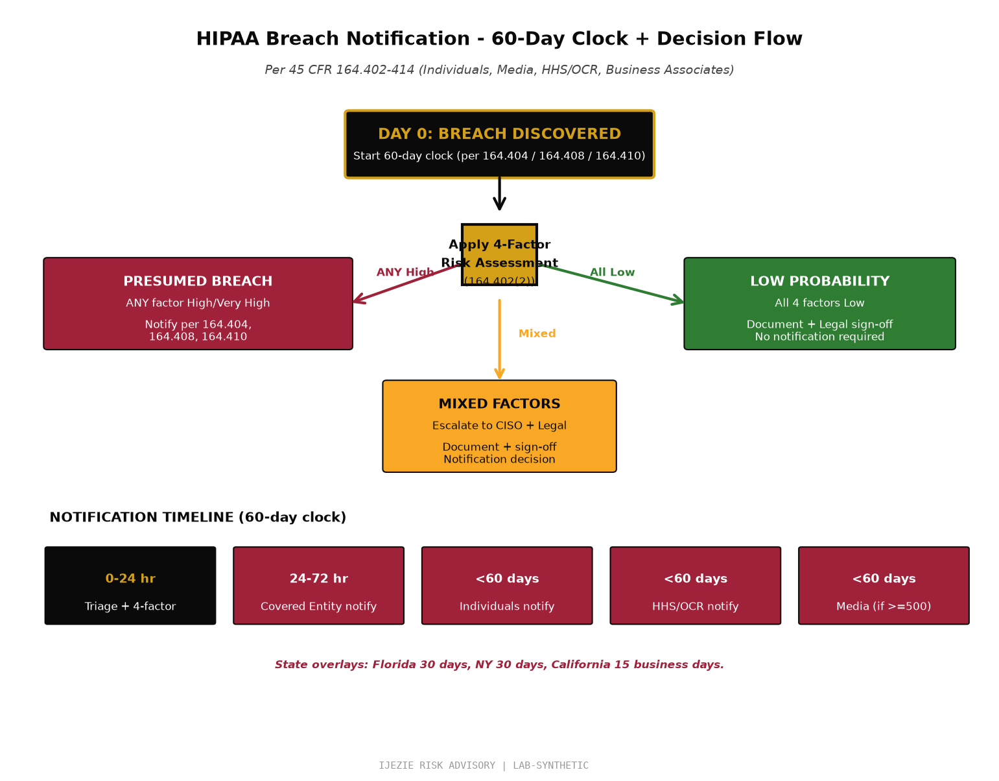

# Helix Health Breach Notification Playbook

**Document Type:** Operational Playbook - HIPAA Breach Notification
**Authority:** 45 CFR §164.404 (Individuals), §164.406 (Media), §164.408 (HHS/OCR), §164.410 (Business Associates), §164.414 (Administrative Requirements)
**Engagement:** Helix Health Inc., Business Associate
**Document Date:** 2026-06-27
**Next Drill:** 2026-09-30 (quarterly)
**Status:** Production - referenced by HH-R-05 mitigation

---

## 1. Why This Playbook Exists

HIPAA's breach notification rule (§164.400-§164.414) is the single hardest piece of HIPAA to operationalize because it requires:

1. **Decision under time pressure** - 60-day clock starts at discovery
2. **Multi-stakeholder notification** - individuals, HHS/OCR, media (for large breaches)
3. **Risk assessment under uncertainty** - the 4-factor risk assessment must be documented
4. **Coordination with Business Associates and Covered Entities** - chain notification
5. **State-specific overlays** - some states have shorter windows (e.g., Florida 30 days, New York 30 days)

The consequences of failure are severe:
- HHS Office for Civil Rights (OCR) investigation
- Civil Monetary Penalties (CMP): $137 to $2,067,813 per violation (2024 inflation-adjusted)
- State Attorney General action
- Reputational damage + class-action litigation
- Loss of BAA-covered customer contracts

This playbook operationalizes the 60-day rule into a decision tree, notification templates, and escalation matrix that the CISO, Legal, and on-call team can execute.

---

## 2. The 60-Day Clock

**Discovery date = Day 0.** Discovery is when the breach is known to Helix (or to a BAA-covered vendor that notifies Helix), NOT when the breach occurred.

| Notification Recipient | Deadline | Authority |
|---|---|---|
| Affected individuals | Without unreasonable delay, no later than 60 days after discovery | §164.404(b) |
| HHS/OCR (breach <500 individuals) | Annual log submission by 60 days after end of calendar year | §164.408(c) |
| HHS/OCR (breach >=500 individuals) | Without unreasonable delay, no later than 60 days after discovery | §164.408(a) |
| Media (breach >=500 individuals in a state) | Without unreasonable delay, no later than 60 days after discovery; notify prominent media outlets serving the affected state | §164.406 |
| Covered Entity (via BAA) | Without unreasonable delay, no later than 60 days after discovery (and per BAA terms) | §164.410 |

**State overlays (more restrictive):**
- Florida: 30 days (§501.171)
- New York: 30 days (§899-aa)
- Texas: 60 days (§521.053)
- California: 15 business days from notification by HIPAA-covered entity (§1798.29)

---

## 3. Breach Definition

Per §164.402, a "breach" is the acquisition, access, use, or disclosure of PHI in a manner not permitted under the Privacy Rule that compromises PHI's security or privacy.

**Presumed to be a breach** unless the risk assessment under §164.402(2) demonstrates low probability that PHI has been compromised based on:

1. The nature and extent of the PHI involved (sensitivity, types of identifiers)
2. The unauthorized person who used the PHI or to whom the disclosure was made (their obligations to protect PHI)
3. Whether the PHI was actually acquired or viewed (vs. merely accessed)
4. The extent to which the risk to PHI has been mitigated (e.g., returned or destroyed)

**Exceptions** (NOT a breach):
- Unintentional access by workforce member acting in good faith and within scope
- Inadvertent disclosure between authorized persons at same organization
- Recipient could not reasonably retain the information

---

## 4. The 4-Factor Risk Assessment (Document This for Every Incident)

Per §164.402(2), document each factor within 24 hours of discovery:

### Factor 1: Nature and Extent of PHI

| PHI Type | Sensitivity Score |
|---|---|
| Name + address + DOB | High |
| Name + SSN | Very High |
| Name + diagnosis + treatment | High |
| Name + insurance ID + billing | Moderate |
| De-identified data (Safe Harbor or Expert Determination) | Low |

### Factor 2: Unauthorized Recipient

| Recipient Type | Risk Score |
|---|---|
| Trusted Business Associate with BAA | Moderate |
| Vendor without BAA | High |
| External attacker | Very High |
| Unknown actor | High (assume worst) |

### Factor 3: Actual Acquisition vs. Access

| Acquisition Status | Risk Score |
|---|---|
| PHI returned or destroyed | Low |
| PHI accessed but not retained | Moderate |
| PHI downloaded to external device | High |
| PHI exfiltrated to unknown location | Very High |

### Factor 4: Mitigation Extent

| Mitigation | Risk Reduction |
|---|---|
| Recipient signed attestation of destruction | Significant |
| Recipient is a covered entity with BAA | Moderate |
| Recipient is not reasonably believed to retain | Minimal |
| No mitigation possible | None |

**Aggregate risk score = product of factors. Document each in the incident ticket and notify per the score:**

- Score <50: Low probability - document and continue monitoring, no notification required
- Score 50-100: Possible breach - escalate to CISO + Legal, presumptive notification
- Score >100: Presumptive breach - notify per §164.404, §164.408, §164.410

---

## 5. Incident Response Decision Tree



```
INCIDENT DISCOVERED
    |
    v
[0-2 hours] INCIDENT TRIAGE
    |
    |- Activate IR plan
    |- Document discovery time (Day 0)
    |- Identify scope: PHI involved, individuals affected, recipient
    |- CISO + Legal notified
    |
    v
[2-24 hours] RISK ASSESSMENT
    |
    |- Apply 4-factor analysis (§164.402(2))
    |- Determine: breach vs. non-breach
    |- If non-breach: document rationale, monitor
    |- If breach: continue below
    |
    v
[24-72 hours] NOTIFICATION PLANNING
    |
    |- Identify affected individuals (count + states)
    |- Draft individual notification letter
    |- Draft Covered Entity notification (via BAA)
    |- Draft OCR notification (if >=500)
    |- Draft media notice (if >=500 in a state)
    |- Draft state attorney general notices (if state requires)
    |- Determine breach classification: <500 or >=500
    |
    v
[3-60 days] NOTIFICATION EXECUTION
    |
    |- Send individual notifications (mail or email per §164.404)
    |- Submit OCR notification (if >=500, within 60 days)
    |- Submit media notice (if >=500, within 60 days)
    |- Submit Covered Entity notification per BAA
    |- Update CISO Risk Register + POA&M
    |
    v
[Post-60 days] POST-INCIDENT REVIEW
    |
    |- Lessons learned session
    |- Update controls as needed
    |- Update IR plan + Breach Notification Playbook
    |- File records retention (6 years minimum per §164.530(j))
```

---

## 6. Escalation Matrix

| Role | Contact | Trigger |
|---|---|---|
| On-Call Engineer | PagerDuty | All incidents |
| CISO | Direct | All confirmed breaches + all "possible breach" determinations |
| Legal | Direct | All confirmed breaches |
| Compliance Officer | Direct | All confirmed breaches |
| CEO + Board | Direct | Breaches >=500 individuals OR breaches attracting media attention |
| Outside Counsel | Pre-arranged | Breaches >=500 individuals OR law enforcement involvement |
| Cyber Insurance Carrier | Policy listed | All confirmed breaches (carrier may provide breach coach) |
| HHS/OCR | TBD by Legal | Breaches >=500 individuals (within 60 days) |
| State Attorney General | TBD by Legal | State-specific requirements (Florida, NY, TX, CA, others) |
| FBI / US-CERT | TBD by Legal | Cybercrime involvement |
| Public Relations Firm | Pre-arranged | Media-attracting breaches |

---

## 7. Notification Templates

### 7.1 Individual Notification Letter (§164.404(c))

```
[Helix Health Letterhead]

[Date - within 60 days of discovery]

[Affected Individual Name]
[Affected Individual Address]

Dear [Name],

We are writing to inform you of a recent incident affecting your protected health information.

WHAT HAPPENED:
[Plain English description of the breach]

WHAT INFORMATION WAS INVOLVED:
[Specific PHI types affected - name, DOB, diagnosis, etc.]

WHAT WE ARE DOING:
[Mitigation steps taken - investigation, notifications, controls updated]

WHAT YOU CAN DO:
[Steps the individual can take - credit monitoring, fraud alerts, etc.]

FOR MORE INFORMATION:
[Helix contact: phone, email, mailing address]

Sincerely,
[CISO Name]
Helix Health, Inc.
```

### 7.2 Covered Entity Notification (§164.410)

```
[Helix Letterhead]

[Date - within 60 days of discovery]

[Covered Entity Privacy Officer]
[Covered Entity Address]

Dear [Covered Entity Contact],

This notice is provided pursuant to our Business Associate Agreement dated [BAA date].

WHAT HAPPENED:
[Description of breach]

INDIVIDUALS AFFECTED:
[Count + identifier types]

INFORMATION INVOLVED:
[PHI types per individual]

ACTIONS TAKEN:
[Mitigation + investigation]

NEXT STEPS:
[How Helix will support Covered Entity's individual notification obligation]

CONTACT:
[Helix contact]

Sincerely,
[CISO Name]
```

### 7.3 OCR Notification (§164.408) - Breaches >=500 Individuals

OCR notification is submitted via the HHS breach portal at https://ocrportal.hhs.gov/ocr/breach/wizard_breach.jsf

Required fields:
- Covered Entity name + contact
- Business Associate name (Helix)
- Date of breach
- Date of discovery
- Type of breach (Hacking/IT, Theft, Loss, Unauthorized Access/Disclosure, Other)
- Location of breached information (Email, Network Server, Paper/Films, Desktop Computer, Laptop, Other Portable Device, etc.)
- Number of individuals affected
- Types of PHI involved (Name, SSN, DOB, Diagnosis, etc.)
- Safeguards in place prior to breach
- Actions taken in response to breach
- Steps individuals can take

### 7.4 Media Notice (§164.406) - Breaches >=500 Individuals in a State

```
FOR IMMEDIATE RELEASE

[Date]

Helix Health Reports Data Breach Affecting [N] Individuals in [State]

[City, State] - Helix Health, Inc. today announced that a recent data breach may have affected the protected health information of approximately [N] individuals in [State].

[Plain English summary]

Affected individuals will receive direct notification by mail.

For more information, contact:
[Phone, email, website]
```

---

## 8. Drill Schedule

This playbook must be drilled quarterly per HH-R-05 mitigation:

| Drill Type | Frequency | Participants | Success Criteria |
|---|---|---|---|
| Tabletop: notification chain | Quarterly | CISO, Legal, Compliance, Engineering on-call | Decision tree executed within 4 hours |
| Tabletop: media scenario | Annually | CISO, Legal, PR firm, CEO | Media notice drafted within 8 hours |
| Live notification test | Annually | CISO, Legal, IT | Test notification sent to Legal team within 2 hours |
| Vendor breach scenario | Annually | CISO, Legal, TPRM, AWS/Datadog account team | BAA notification chain tested end-to-end |

**Next drill:** 2026-09-30

---

## 9. Documentation and Records Retention

Per §164.530(j), breach notification records must be retained for 6 years from creation.

Required documentation per breach:
- Incident ticket (timestamps, decision rationale)
- 4-factor risk assessment (§164.402(2))
- Notification letters sent (with proof of delivery)
- OCR submission confirmation
- Media notice (if applicable)
- State AG notice (if applicable)
- Post-incident review notes
- Updated controls (if applicable)

Storage location: Legal repository + CISO Assistant incident record

---

## 10. What This Demonstrates

This Breach Notification Playbook shows operational vCISO work that does not appear in AtlasPay or any other framework portfolio:

1. **60-day clock operationalized.** Discovery date is Day 0. Decision tree gives the team a clear path at each decision point.
2. **4-factor risk assessment documented.** Per §164.402(2), this is required for every incident and must be defensible.
3. **Multi-stakeholder notification.** Individuals, Covered Entities, HHS/OCR, media, state AGs all have different notification rules.
4. **Notification templates.** Letters drafted for each notification type so the team is not drafting under pressure.
5. **Drill cadence.** Quarterly tabletop + annual live test. This is the only way to verify the playbook works.
6. **State-specific overlays.** Florida 30-day, NY 30-day, CA 15 business days. These overrides must be in the playbook or they get missed.
7. **Records retention.** §164.530(j) requires 6-year retention. The storage location is specified.

A real OCR auditor reviewing this playbook would see that Helix can execute the breach notification rule under time pressure, with documented decision rationale, and with all stakeholders notified correctly. This is the operational artifact AtlasPay doesn't have (AtlasPay's notification rules are different - state breach notification laws + contractual notification, not HIPAA's §164.400-§164.414).

---

## 11. Review and Update Schedule

- Quarterly tabletop drill
- Annual playbook refresh (after each drill, capture lessons learned)
- Material change trigger: regulatory update, BAA renewal change, new vendor with BAA, personnel change in CISO/Legal role

**Owner:** CISO + Legal
**Approver:** CEO + Board Privacy Committee