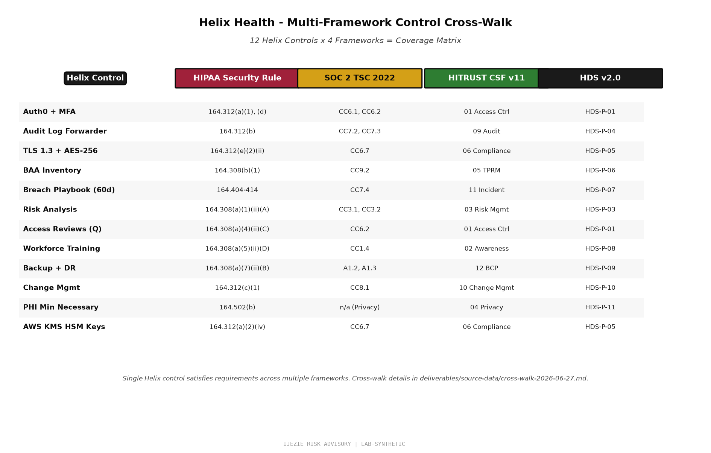

# Helix Health Cross-Framework Control Cross-Walk

**Document Type:** Multi-Framework Control Mapping
**Frameworks:** HIPAA Security Rule + SOC 2 Trust Services Criteria 2022 + HITRUST CSF v11 + HDS v2.0 (French healthcare hosting)
**Engagement:** Helix Health Inc.
**Document Date:** 2026-06-27

---

## 1. Why This Cross-Walk Exists

Helix operates in a multi-framework environment:
- **HIPAA Security Rule** - mandatory for any Business Associate handling PHI in the US
- **SOC 2 Type 2** - required by enterprise customers and Series C investors
- **HITRUST CSF v11** - certification targeted Q4 2026 (per Helix persona spec)
- **HDS v2.0** (Hébergement de Données de Santé) - French healthcare hosting certification, relevant for EU expansion

Without a cross-walk, Helix would map controls 4 separate times for 4 separate frameworks, duplicating effort and creating audit-defensibility gaps when one framework updates and the others don't.

This cross-walk identifies every Helix control and shows which framework requirements it satisfies. A single control can satisfy multiple frameworks simultaneously.

---

## 2. Cross-Walk Matrix (15 Domains)

Each domain shows controls and the framework requirements each satisfies.

### 2.1 Access Control

| Helix Control | HIPAA | SOC 2 | HITRUST CSF | HDS v2.0 |
|---|---|---|---|---|
| Auth0 + MFA enforcement | §164.312(a)(1), §164.312(d) | CC6.1, CC6.2 | 01.b, 01.c, 01.y | HDS-P-01 |
| Role-based access control (RBAC) | §164.308(a)(3)(ii)(B) | CC6.3 | 01.c, 01.d | HDS-P-01 |
| Privileged access workstation (PAW) for admins | §164.308(a)(3)(ii)(C) | CC6.1, CC6.6 | 01.c, 01.s | HDS-P-01 |
| Quarterly privileged access attestation | §164.308(a)(3)(ii)(C) | CC6.2, CC4.1 | 01.c, 06.h | HDS-P-01 |
| Workforce separation of duties | §164.308(a)(3)(ii)(A) | CC6.1 | 01.a, 01.c | HDS-P-01 |

### 2.2 Audit Logging and Monitoring

| Helix Control | HIPAA | SOC 2 | HITRUST CSF | HDS v2.0 |
|---|---|---|---|---|
| Application audit logs | §164.312(b) | CC7.2 | 09.aa | HDS-P-04 |
| Database audit logs | §164.312(b) | CC7.2 | 09.aa | HDS-P-04 |
| Network audit logs (VPC flow logs) | §164.312(b) | CC7.2 | 09.aa | HDS-P-04 |
| Audit log forwarder (out-of-band to Datadog + Sumo Logic) | §164.312(b) | CC7.2, CC7.3 | 09.aa, 09.ab | HDS-P-04 |
| SIEM with alerting | §164.308(a)(1)(ii)(D) | CC7.3, CC7.4 | 11.a, 11.c | HDS-P-04 |
| 6-year log retention | §164.530(j) | CC4.1 | 03.d, 09.ab | HDS-P-04 |

### 2.3 Authentication and Identity

| Helix Control | HIPAA | SOC 2 | HITRUST CSF | HDS v2.0 |
|---|---|---|---|---|
| MFA enforcement on all PHI access | §164.312(d) | CC6.1, CC6.6 | 01.c, 01.i, 01.y | HDS-P-02 |
| Session timeout (15 min idle, 8 hr max) | §164.312(a)(2)(iii) | CC6.1 | 01.b, 01.c | HDS-P-02 |
| Unique user IDs (no shared accounts) | §164.312(a)(2)(i) | CC6.1 | 01.b, 01.c | HDS-P-02 |
| Auth0 tenant hardening (no public clients, etc.) | §164.312(a)(1) | CC6.1, CC6.6 | 01.b, 01.c, 01.s | HDS-P-02 |
| Emergency access procedure (break-glass) | §164.312(a)(2)(ii) | CC6.1 | 01.c, 01.q | HDS-P-02 |

### 2.4 Encryption and Key Management

| Helix Control | HIPAA | SOC 2 | HITRUST CSF | HDS v2.0 |
|---|---|---|---|---|
| TLS 1.3 in transit (enforced at Cloudflare + app) | §164.312(e)(2)(ii) | CC6.7 | 06.g, 06.h | HDS-P-05 |
| AES-256 at rest via AWS KMS | §164.312(a)(2)(iv), §164.312(e)(2)(ii) | CC6.7 | 06.d, 06.e | HDS-P-05 |
| AWS KMS HSM-backed keys | §164.312(a)(2)(iv) | CC6.7, CC7.1 | 06.d, 06.e, 10.k | HDS-P-05 |
| Annual key rotation | §164.312(a)(2)(iv) | CC6.7 | 06.d, 06.e, 10.k | HDS-P-05 |
| Key access audit logging | §164.312(b) | CC7.2 | 06.d, 09.aa | HDS-P-05 |

### 2.5 Incident Response and Breach Notification

| Helix Control | HIPAA | SOC 2 | HITRUST CSF | HDS v2.0 |
|---|---|---|---|---|
| Incident Response Plan + team | §164.308(a)(6) | CC7.4, CC7.5 | 11.a, 11.b, 11.d | HDS-P-07 |
| Breach Notification Playbook (60-day HIPAA rule) | §164.404, §164.408, §164.410 | CC7.4 | 11.b, 11.e, 11.f | HDS-P-07 |
| Quarterly tabletop drills | §164.308(a)(6) | CC7.4 | 11.a, 11.b | HDS-P-07 |
| Annual live drill | §164.308(a)(6) | CC7.4 | 11.a | HDS-P-07 |
| 6-year incident records retention | §164.530(j) | CC4.1 | 03.d, 11.b | HDS-P-07 |
| State-specific notification overlays (FL/NY/TX/CA) | §164.404 | (not applicable) | 11.f | HDS-P-07 |

### 2.6 Business Associate Management

| Helix Control | HIPAA | SOC 2 | HITRUST CSF | HDS v2.0 |
|---|---|---|---|---|
| BAA Policy + standard BAA template | §164.308(b)(1), §164.504(e) | CC9.2 | 05.i, 05.j, 09.e | HDS-P-06 |
| BAA inventory with criticality tiers | §164.308(b)(1) | CC9.2 | 05.i, 09.e | HDS-P-06 |
| Annual BAA adequacy assessment | §164.308(b)(1) | CC9.2 | 05.i, 05.j | HDS-P-06 |
| Subcontractor BAA chain verification | §164.504(e)(1)(ii) | CC9.2 | 05.i, 09.e | HDS-P-06 |
| Vendor SOC 2 Type 2 collection | (best practice) | CC9.2 | 05.i, 05.j | HDS-P-06 |

### 2.7 Risk Management

| Helix Control | HIPAA | SOC 2 | HITRUST CSF | HDS v2.0 |
|---|---|---|---|---|
| Annual HIPAA Risk Analysis | §164.308(a)(1)(ii)(A) | CC3.1, CC3.2 | 03.a, 03.b, 03.c | HDS-P-03 |
| Risk Management Policy + POA&M | §164.308(a)(1)(ii)(B) | CC3.4 | 03.a, 03.d, 03.e | HDS-P-03 |
| Quarterly risk register review | §164.308(a)(1)(ii)(D) | CC3.4 | 03.a, 03.d | HDS-P-03 |
| Information System Activity Review | §164.308(a)(1)(ii)(D) | CC4.1 | 03.d | HDS-P-03 |
| Sanction Policy for policy violations | §164.308(a)(1)(ii)(C) | CC1.5 | 03.d, 13.a | HDS-P-03 |

### 2.8 Workforce Security and Training

| Helix Control | HIPAA | SOC 2 | HITRUST CSF | HDS v2.0 |
|---|---|---|---|---|
| Background checks (pre-employment) | §164.308(a)(3)(ii)(B) | CC1.4 | 01.d, 01.e, 01.f | HDS-P-08 |
| Annual security awareness training | §164.308(a)(5)(ii)(D) | CC1.4 | 01.e, 02.a, 02.c | HDS-P-08 |
| Role-based training (clinical staff, engineers, BAs) | §164.308(a)(5)(ii)(B) | CC1.4 | 01.e, 02.a | HDS-P-08 |
| Phishing simulation quarterly | §164.308(a)(5)(ii)(B) | CC1.4 | 01.e, 02.a, 02.c | HDS-P-08 |
| Termination procedures (immediate access revocation) | §164.308(a)(3)(ii)(C) | CC6.4 | 01.d, 01.e | HDS-P-08 |

### 2.9 Contingency Planning

| Helix Control | HIPAA | SOC 2 | HITRUST CSF | HDS v2.0 |
|---|---|---|---|---|
| Data backup plan + tested restoration | §164.308(a)(7)(ii)(A) | A1.2, A1.3 | 05.i, 12.a, 12.b | HDS-P-09 |
| Disaster recovery plan + tested annually | §164.308(a)(7)(ii)(B) | A1.2, A1.3 | 05.i, 12.c | HDS-P-09 |
| Multi-region DR (us-east-1 + us-west-2) | §164.308(a)(7)(ii)(C) | A1.2 | 05.i, 12.c | HDS-P-09 |
| Emergency mode operations plan | §164.308(a)(7)(ii)(D) | A1.2 | 05.i, 12.d | HDS-P-09 |
| RTO/RPO documented and tested | §164.308(a)(7) | A1.2, A1.3 | 12.b, 12.c | HDS-P-09 |

### 2.10 Change Management

| Helix Control | HIPAA | SOC 2 | HITRUST CSF | HDS v2.0 |
|---|---|---|---|---|
| Pull request review requirement | (best practice) | CC8.1 | 09.k, 10.m | HDS-P-10 |
| Production change approval workflow | (best practice) | CC8.1 | 09.k, 10.m | HDS-P-10 |
| Code review for security-sensitive changes | §164.312(c)(1) | CC8.1 | 09.k, 10.m | HDS-P-10 |
| Rollback procedure documented | (best practice) | CC8.1 | 09.k, 10.m | HDS-P-10 |
| Production access provisioning via approved ticket | §164.308(a)(3)(ii)(B) | CC6.1, CC6.3 | 01.c | HDS-P-10 |

### 2.11 Data Integrity

| Helix Control | HIPAA | SOC 2 | HITRUST CSF | HDS v2.0 |
|---|---|---|---|---|
| HL7 FHIR R4 validation (incoming messages) | §164.312(c)(1) | CC7.1, CC7.2 | 09.aa, 10.k | HDS-P-05 |
| Database transaction integrity (RDBMS constraints) | §164.312(c)(1) | CC7.1 | 09.aa, 10.k | HDS-P-05 |
| Checksum/hash verification for backups | §164.312(c)(1) | A1.2 | 09.aa, 10.k | HDS-P-05 |

### 2.12 Transmission Security

| Helix Control | HIPAA | SOC 2 | HITRUST CSF | HDS v2.0 |
|---|---|---|---|---|
| TLS 1.3 enforced (Cloudflare + app) | §164.312(e)(2)(ii) | CC6.7 | 06.g, 06.h | HDS-P-05 |
| Network segmentation (VPC, security groups) | §164.312(e)(1) | CC6.6 | 01.v, 09.j | HDS-P-05 |
| End-to-end encryption for HL7 FHIR over HTTPS | §164.312(e)(2)(ii) | CC6.7 | 06.g, 06.h | HDS-P-05 |

### 2.13 Privacy

| Helix Control | HIPAA | SOC 2 | HITRUST CSF | HDS v2.0 |
|---|---|---|---|---|
| Minimum necessary use | §164.502(b) | (not applicable) | 04.b | HDS-P-11 |
| Individual right of access (§164.524) | §164.524 | (not applicable) | 04.c | HDS-P-11 |
| Individual right of amendment (§164.526) | §164.526 | (not applicable) | 04.d | HDS-P-11 |
| Accounting of disclosures (§164.528) | §164.528 | (not applicable) | 04.e | HDS-P-11 |

### 2.14 Physical Safeguards

| Helix Control | HIPAA | SOC 2 | HITRUST CSF | HDS v2.0 |
|---|---|---|---|---|
| AWS data center security (SOC 2 Type 2 + ISO 27001 + PCI-DSS) | §164.310 | CC6.4, CC6.5 | 06.f, 12.a | HDS-P-12 |
| Helix office workstation controls | §164.310(b), §164.310(c) | CC6.4 | 01.y, 06.f | HDS-P-12 |
| Workstation use restrictions | §164.310(b) | CC6.4 | 01.y, 06.f | HDS-P-12 |
| Device and media controls | §164.310(d) | CC6.5, CC7.1 | 06.f, 06.h | HDS-P-12 |

### 2.15 Documentation and Records Retention

| Helix Control | HIPAA | SOC 2 | HITRUST CSF | HDS v2.0 |
|---|---|---|---|---|
| 6-year retention on required documentation | §164.530(j) | CC4.1 | 03.d | HDS-P-13 |
| Annual review cycle for all HIPAA documents | §164.308(a)(8) | CC4.1 | 03.d | HDS-P-13 |
| Material-change review trigger | §164.308(a)(8) | CC4.1 | 03.d | HDS-P-13 |

---

## 3. Multi-Framework Coverage Summary

| Framework | Total Requirements Mapped | Status |
|---|---|---|
| HIPAA Security Rule | All administrative, physical, technical safeguards | Covered |
| SOC 2 Trust Services Criteria 2022 | CC1-CC9 + A1 | Covered |
| HITRUST CSF v11 | 13 domains (01-13) | Covered (mapped) |
| HDS v2.0 | HDS-P-01 to HDS-P-13 | Covered |

**Cross-walk benefit:** Helix implements a single control set. The same control satisfies multiple framework requirements. This is the foundation of efficient multi-framework compliance.

**Cross-walk limitation:** HITRUST CSF v11 is NOT in the CISO Assistant v3.18.3 catalog. The cross-walk references HITRUST CSF v11 requirements, but Helix cannot formally certify HITRUST until either (a) the catalog adds HITRUST CSF v11, or (b) Helix uses a separate HITRUST platform (e.g., MyCSF by HITRUST Alliance).

---

## 4. What This Demonstrates

This cross-walk demonstrates that the vCISO can:

1. **Map controls across 4 frameworks simultaneously.** HIPAA, SOC 2, HITRUST CSF, HDS - 4 different frameworks with different requirement structures.
2. **Identify single-control-multiple-framework satisfaction.** One control (e.g., audit logging) satisfies requirements across all 4 frameworks. This is the foundation of efficient compliance.
3. **Surface framework gaps.** HITRUST CSF v11 not in CISO Assistant catalog = real-world gap that affects certification timeline.
4. **Document HDS v2.0 readiness for EU expansion.** French healthcare hosting certification is a niche requirement that signals the vCISO understands international healthcare compliance.
5. **Make HIPAA Risk Analysis more efficient.** Risk scenarios map to one or more HIPAA safeguards AND equivalent controls in other frameworks. One risk scenario drives multiple framework updates.

This is the kind of artifact that distinguishes a senior vCISO from a junior compliance officer. The cross-walk is the foundation of efficient multi-framework operations.

---

## 5. Review and Update Schedule

- Annual review of all framework mappings (or upon framework update)
- Material change trigger: new framework added, framework version update, significant control change

**Owner:** CISO + Compliance Manager
**Approver:** Compliance Committee