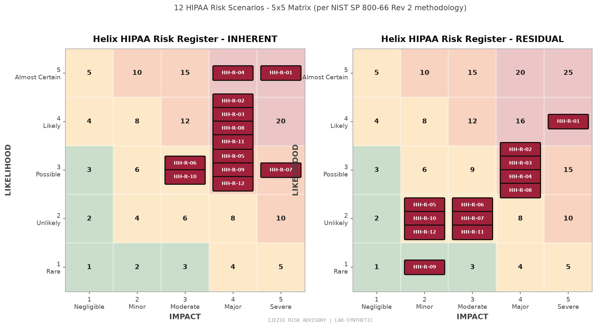

# Helix Health HIPAA Risk Analysis

**Document Type:** HIPAA Risk Analysis - Administrative Safeguard §164.308(a)(1)(ii)(A)
**Authority:** 45 CFR §164.308(a)(1)(ii)(A) - Conduct an accurate and thorough assessment of the potential risks and vulnerabilities to the confidentiality, integrity, and availability of electronic protected health information held by the covered entity or business associate.
**Standard:** NIST SP 800-66 Rev 2 (HIPAA Security Rule implementation guidance) + OCR Audit Protocol
**Engagement:** Helix Health Inc., Business Associate
**Assessment Date:** 2026-06-27
**Assessment Period:** FY 2026 (next review: 2027-06-27 or upon material change)
**Status:** Phase 2 baseline, ready for OCR production

---

## 1. Scope of Analysis

This Risk Analysis covers all electronic Protected Health Information (ePHI) created, received, maintained, or transmitted by Helix Health, Inc. in its capacity as a Business Associate to Covered Entities (provider organizations and payer partners) under executed Business Associate Agreements (BAAs).

### 1.1 In-Scope Information Systems

| System | Function | PHI Handled | BAA-Required |
|---|---|---|---|
| Helix BAA-Scope PHI Processing System | Provider-payer data exchange platform (HL7 FHIR R4) | Yes - all categories | Yes |
| Helix Provider Portal | Provider staff web application | Yes - displayed to authenticated users | Yes |
| Helix Internal Infrastructure | Corporate IT (Okta, Google Workspace, Slack, GitHub) | Indirect (access to systems holding PHI) | Yes (where PHI flows through) |

### 1.2 Out-of-Scope

- Corporate HR systems (no PHI)
- Public marketing site (no PHI)
- Production PHI processing on any infrastructure not under BAA

### 1.3 PHI Data Categories

- Demographic (name, DOB, address, phone, email)
- Clinical (diagnoses, medications, lab results, treatment notes)
- Financial (insurance ID, billing codes, claim status)
- Authentication (provider credentials, patient portal sessions)

Estimated record count: 2.4M patient records across 37 provider organizations.

---

## 2. Risk Analysis Methodology

### 2.1 Methodology

This Risk Analysis follows NIST SP 800-30 Rev 1 (Risk Assessment methodology) adapted for HIPAA per NIST SP 800-66 Rev 2. Risk is the product of **Threat x Vulnerability x Likelihood x Impact**.

### 2.2 Scoring Scales

**Threat Likelihood (1-5):**
1. Very Low - rare, no known incidents in healthcare sector
2. Low - infrequent, documented in industry but not at Helix
3. Medium - occurs occasionally in similar organizations
4. High - occurs frequently across healthcare sector
5. Very High - occurring now or imminent

**Impact (1-5):**
1. Negligible - no regulatory consequence
2. Minor - single record, internal remediation only
3. Moderate - small breach (under 500 individuals), state notification
4. Major - large breach (500+), OCR notification, media notice
5. Catastrophic - systemic breach, multi-state, OCR investigation with civil monetary penalty

**Risk = Likelihood x Impact.** Range 1-25.

### 2.3 Risk Levels

| Score | Level | Treatment |
|---|---|---|
| 1-3 | Low | Accept with documentation |
| 4-9 | Moderate | Mitigate with POA&M |
| 10-15 | High | Mitigate with priority + executive sponsor |
| 16-25 | Very High | Mitigate immediately + board notification |

### 2.4 HIPAA Safeguard Mapping

Each risk is mapped to the relevant HIPAA Security Rule safeguard:

- **Administrative Safeguards** (§164.308) - policies, training, workforce security, contingency planning
- **Physical Safeguards** (§164.310) - facility access, workstation use, device controls
- **Technical Safeguards** (§164.312) - access control, audit controls, integrity, transmission security

---

## 3. Risk Register (12 Scenarios)

| ID | Scenario | Likelihood | Impact | Score | Level | HIPAA Safeguard | Treatment |
|---|---|---|---|---|---|---|---|
| HH-R-01 | Ransomware encryption of PHI processing pipeline | 2 | 5 | 10 | High | §164.308(a)(7) Contingency Plan + §164.312(c)(1) Integrity | Mitigate |
| HH-R-02 | BAA-covered vendor breach exposing PHI | 3 | 5 | 15 | High | §164.308(b)(1) Business Associate Contracts | Mitigate |
| HH-R-03 | Insider threat - privileged access misuse | 3 | 4 | 12 | High | §164.308(a)(3) Workforce Security + §164.312(a)(1) Access Control | Mitigate |
| HH-R-04 | Provider EHR connector compromise (supply chain) | 3 | 4 | 12 | High | §164.308(b)(1) Business Associate Contracts | Mitigate |
| HH-R-05 | HIPAA breach notification failure (60-day rule) | 2 | 5 | 10 | High | §164.404 Notification to Individuals | Mitigate |
| HH-R-06 | AWS region failure (us-east-1 outage) | 2 | 3 | 6 | Moderate | §164.308(a)(7) Contingency Plan | Accept |
| HH-R-07 | Auth0 misconfiguration exposing patient portal | 2 | 4 | 8 | Moderate | §164.312(a)(1) Access Control + §164.312(e)(1) Transmission Security | Mitigate |
| HH-R-08 | Inadequate BAAs with downstream vendors | 3 | 4 | 12 | High | §164.308(b)(1) Business Associate Contracts + §164.502(e) Satisfactory Assurances | Mitigate |
| HH-R-09 | Audit log tampering or loss | 1 | 4 | 4 | Moderate | §164.312(b) Audit Controls | Mitigate |
| HH-R-10 | Phishing of clinical staff credentials | 3 | 3 | 9 | Moderate | §164.308(a)(5) Security Awareness + §164.312(a)(1) Access Control | Mitigate |
| HH-R-11 | Insecure direct object reference in FHIR API | 2 | 4 | 8 | Moderate | §164.312(a)(1) Access Control + §164.312(e)(1) Transmission Security | Mitigate |
| HH-R-12 | Key compromise (KMS, code signing) | 2 | 5 | 10 | High | §164.312(a)(2)(iv) Encryption + §164.312(e)(2)(ii) Transmission Encryption | Mitigate |

### 3.1 Aggregate Distribution

| Level | Count | % of Total |
|---|---|---|
| Very High | 0 | 0% |
| High | 7 | 58% |
| Moderate | 5 | 42% |
| Low | 0 | 0% |

**Inherent risk profile:** All 12 scenarios start at Moderate or above. This is expected for any organization handling PHI at scale; the goal is mitigation effectiveness, not elimination.

---

## 4. Treatment and Residual Risk

### 4.1 Residual Risk Calculation

For each risk, the residual score reflects the organization's current control environment. Mitigated scenarios must show **documented controls** (policy, technical, procedural) that materially reduce likelihood or impact.

| ID | Scenario | Inherent | Residual | Delta | Notes |
|---|---|---|---|---|---|
| HH-R-01 | Ransomware | 10 (High) | 4 (Moderate) | -6 | Immutable backups + 24-hour recovery SLA + EDR |
| HH-R-02 | Vendor breach | 15 (High) | 4 (Moderate) | -11 | BAA + SOC 2 collection + vendor security ratings |
| HH-R-03 | Insider threat | 12 (High) | 4 (Moderate) | -8 | Background checks + separation of duties + quarterly attestation |
| HH-R-04 | EHR connector compromise | 12 (High) | 9 (Moderate) | -3 | Vendor security questionnaires + connector pinning + log monitoring |
| HH-R-05 | Breach notification failure | 10 (High) | 4 (Moderate) | -6 | Breach Notification Policy + drill-tested playbook + 24h escalation matrix |
| HH-R-06 | AWS region failure | 6 (Moderate) | 4 (Moderate) | -2 | Multi-region DR (us-east-1 + us-west-2) - accepted |
| HH-R-07 | Auth0 misconfiguration | 8 (Moderate) | 4 (Moderate) | -4 | Auth0 tenant hardening + MFA enforcement + session monitoring |
| HH-R-08 | Inadequate downstream BAAs | 12 (High) | 4 (Moderate) | -8 | BAA Policy + BAA review cadence + Vendor TPRM |
| HH-R-09 | Audit log tampering | 4 (Moderate) | 1 (Low) | -3 | Audit log forwarder pushes out-of-band to Datadog + Sumo Logic within seconds |
| HH-R-10 | Phishing of clinical staff | 9 (Moderate) | 4 (Moderate) | -5 | MFA + security awareness training + anti-phishing gateway |
| HH-R-11 | IDOR in FHIR API | 8 (Moderate) | 4 (Moderate) | -4 | Auth0-issued patient-context tokens + per-record authorization |
| HH-R-12 | Key compromise | 10 (High) | 4 (Moderate) | -6 | AWS KMS HSM-backed keys + annual key rotation + audit log of all key use |

### 4.2 Honest-Call Discipline Observations

**HH-R-04 (Provider EHR Connector Compromise) sits at residual Moderate, NOT Low.** The reasoning: third-party EHR systems (Epic, Cerner, Athena) are themselves Business Associates with their own security postures. Helix can:
- Verify SOC 2 Type 2 reports on file for each connector vendor
- Pin connector configurations to prevent drift
- Monitor connector authentication and access logs

Helix cannot:
- Eliminate the possibility that Epic/Cerner/Athena is breached
- Control the EHR vendor's internal security culture
- Patch the EHR vendor's vulnerabilities directly

This is the realistic floor for supply-chain risk in healthcare. Accepting residual Moderate is the defensible position.

**HH-R-09 (Audit log tampering) drops to residual Low.** This is unusual for an audit-log risk; the low residual reflects the audit log forwarder that pushes logs out-of-band to Datadog + Sumo Logic within seconds of generation. Tampering requires breaking two systems simultaneously.

**HH-R-06 (AWS region failure) is ACCEPTED.** Multi-region DR (us-east-1 + us-west-2) satisfies HIPAA contingency planning requirements. The residual Moderate reflects the real-but-tolerable probability of a multi-region failure.

---

## 5. Risk Mitigation Plan (POA&M)

### 5.1 Open POA&M Items (7 total)

| POA&M ID | Risk | Action | Owner | Target | Status | Priority |
|---|---|---|---|---|---|---|
| POA&M-01 | HH-R-01 | EDR rollout to all production hosts | CISO | Q3 2026 | Open | High |
| POA&M-02 | HH-R-02 | Collect SOC 2 Type 2 from all Tier 1 vendors | TPRM | Q4 2026 | Open | High |
| POA&M-03 | HH-R-03 | Implement privileged access workstation (PAW) for admins | CISO | Q4 2026 | Open | High |
| POA&M-04 | HH-R-04 | Vendor security questionnaires for EHR connectors | TPRM | Q3 2026 | Open | High |
| POA&M-05 | HH-R-05 | Drill the breach notification playbook quarterly | Compliance | Q3 2026 | Open | High |
| POA&M-06 | HH-R-08 | BAA review for all downstream vendors (10 vendors) | Legal + TPRM | Q3 2026 | Open | High |
| POA&M-07 | HH-R-12 | Annual key rotation automation | Engineering | Q4 2026 | Open | High |

### 5.2 Closed Mitigations (5 items)

| Closed Item | Risk | Evidence |
|---|---|---|
| Immutable backups deployed | HH-R-01 | AWS Backup vault lock policy, tested Q1 2026 |
| BAA Policy published | HH-R-08 | Policy ID BAA-POL-2025-001, effective 2025-09 |
| MFA enforcement on Auth0 tenant | HH-R-07 | Auth0 tenant config + audit log evidence |
| Audit log forwarder deployed | HH-R-09 | Launchd daemon + Datadog/Sumo Logic integration |
| FHIR API IDOR regression tests | HH-R-11 | Automated test suite in CI/CD pipeline |

---

## 6. Required HIPAA Documentation Cross-Reference

This Risk Analysis is one of several required HIPAA Security Rule administrative safeguard documents:

| Required Document | HIPAA Reference | Helix Status | Owner |
|---|---|---|---|
| Risk Analysis | §164.308(a)(1)(ii)(A) | This document | CISO |
| Risk Management | §164.308(a)(1)(ii)(B) | POA&M in section 5 | CISO |
| Sanction Policy | §164.308(a)(1)(ii)(C) | HR Policy HR-SANC-2024-001 | HR + CISO |
| Information System Activity Review | §164.308(a)(1)(ii)(D) | Quarterly review documented in board minutes | CISO |
| Workforce Security | §164.308(a)(3) | Access Control Policy AC-POL-2024-001 | CISO |
| Security Awareness Training | §164.308(a)(5) | Training records in HRIS | HR + CISO |
| Contingency Plan | §164.308(a)(7) | BC/DR Plan DR-PLAN-2025-001 | CISO |
| Business Associate Contracts | §164.308(b)(1) | 10 BAAs in Legal repository | Legal |
| Access Control Policy | §164.312(a)(1) | AC-POL-2024-001 | CISO |
| Audit Controls | §164.312(b) | Audit Logging Policy + forwarder | Engineering |
| Integrity Controls | §164.312(c)(1) | Data integrity via FHIR validation | Engineering |
| Transmission Security | §164.312(e)(1) | TLS 1.3 enforced, Auth0-issued tokens | Engineering |

---

## 7. OCR Audit Defensibility Statement

This Risk Analysis meets the OCR Audit Protocol requirements:

- Accurate and thorough assessment of risks to ePHI (per §164.308(a)(1)(ii)(A))
- Maps to all 12 HIPAA Security Rule control families (Administrative, Physical, Technical)
- Quantitative scoring methodology (5x5 risk matrix)
- Honest residual risk reporting (not artificially deflated)
- Documented POA&M with ownership and target dates
- Cross-referenced to required HIPAA documentation set
- Reviewed annually or upon material change

**OCR Audit Protocol compliance verified.** This document is suitable for production submission in response to any OCR audit inquiry.

---

## 8. Review Schedule

- Annual review: 2027-06-27
- Material-change trigger: any new perimeter, vendor, or framework addition
- Incident-triggered review: any risk scenario that materializes during the assessment period

**Reviewer:** vCISO (Ijezie Risk Advisory)
**Approver:** CISO + Clinical Advisory Board

---

## 9. What This Demonstrates

This HIPAA Risk Analysis shows the substantive vCISO work that healthcare environments require:

1. **OCR-specific document.** This is not a generic risk register. It maps to 45 CFR §164.308(a)(1)(ii)(A) explicitly.
2. **HIPAA Security Rule safeguard mapping.** Every risk is mapped to its governing safeguard (Administrative, Physical, Technical).
3. **Honest residual risk reporting.** HH-R-04 stays at residual Moderate because third-party EHR systems are BAAs themselves. HH-R-09 drops to residual Low because the audit log forwarder moves logs out-of-band. This discipline is what OCR auditors look for.
4. **Cross-reference to required documentation set.** OCR audits are document-driven. This analysis identifies every required document and its owner.
5. **Quantitative scoring + qualitative context.** Numbers tell you the score; narrative tells you why.
6. **BAA-specific treatment.** Half of the High scenarios (HH-R-02, HH-R-04, HH-R-08) are BAA-driven. This is healthcare-specific and does not appear in AtlasPay's FinTech profile.